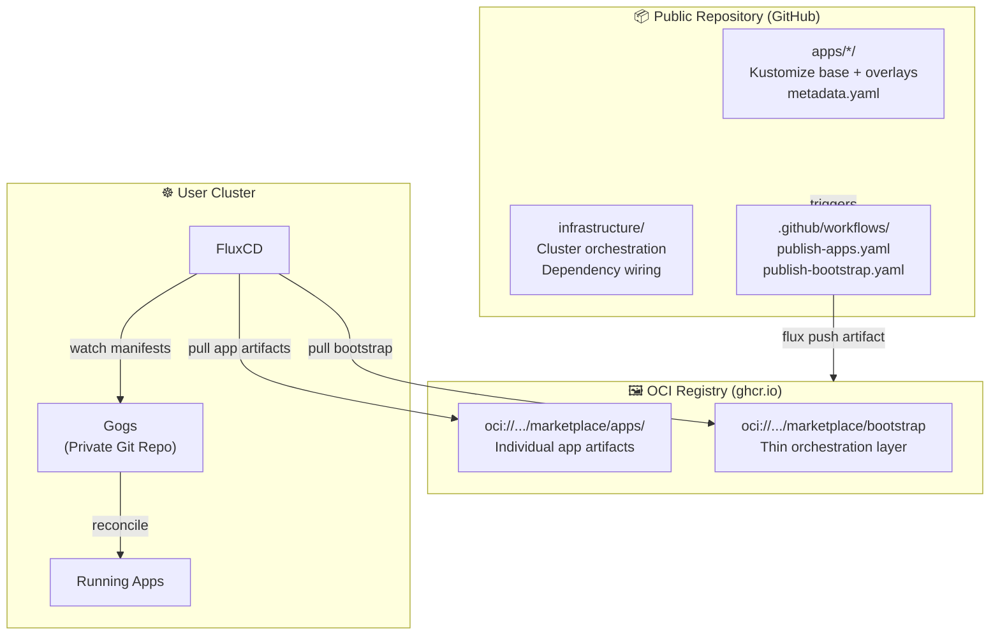
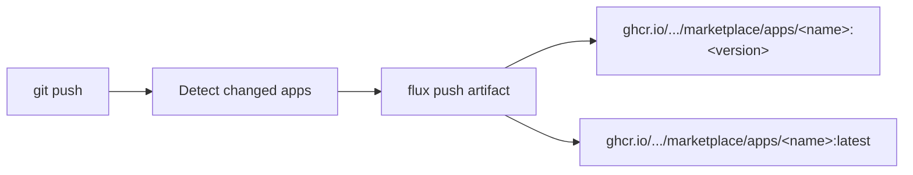

# 🏪 LibrePod Marketplace

OCI-based app marketplace for self-hosted Kubernetes clusters. Each app is
published as an individual OCI artifact, deployed via FluxCD GitOps, and
configured through a private Gogs repository on the user's cluster.

---

## 🏗️ Architecture



### How it works

1. **Bootstrap** — User applies a single `OCIRepository` + `Kustomization` pointing
   at the bootstrap artifact. FluxCD pulls it and starts deploying system
   infrastructure (Traefik, cert-manager, Gogs, etc.).
2. **Gogs init** — A Kubernetes Job bootstraps a private `user-apps`
   repository on the local Gogs instance and creates auth credentials for Flux.
3. **User-apps wiring** — Flux begins watching the private Gogs repo. All
   user app state lives there as standard Kubernetes and Flux manifests.
4. **App installation (git-first)** — User copies template manifests from
   `metadata.yaml` into the Gogs repo, fills in their domain and secrets,
   commits. Flux detects the change, pulls the app's OCI artifact, and deploys.

---

### TLS / IngressRoute Convention

All apps expose HTTP via Traefik `IngressRoute` resources. TLS certificates are
handled by Traefik's default certificate store — apps do **not** configure `tls:`
blocks on their IngressRoutes unless they need a specific cert resolver or custom
TLS options. The default certificate is provisioned by cert-manager and applied
cluster-wide via Traefik's TLS store.

---

## 📂 Repository Structure

```
.
├── apps/                          # 📱 Application definitions
│   ├── traefik/                   # System app (ingress controller)
│   │   ├── base/                  #   Kustomize base manifests
│   │   ├── overlays/librepod/     #   LibrePod-specific overlay
│   │   └── metadata.yaml          #   App metadata + install templates
│   ├── gogs/                      # System app (private Git hosting)
│   │   ├── base/
│   │   ├── components/
│   │   │   ├── postgres/          #   PostgreSQL sidecar component
│   │   │   └── repo-init/         #   User-apps repo bootstrap
│   │   ├── overlays/librepod/
│   │   └── metadata.yaml
│   ├── vaultwarden/               # User-installable app
│   │   ├── base/
│   │   ├── overlays/librepod/
│   │   └── metadata.yaml
│   └── ...
├── clusters/                      # 🔵 FluxCD cluster definitions
│   └── librepod/
│       ├── flux-system/           #   Flux operator/instance config
│       ├── system-apps.yaml       #   System apps Kustomization
│       └── system-configs.yaml    #   System configs Kustomization
├── infrastructure/                # ⚙️ Infrastructure orchestration
│   ├── system-apps/               #   OCIRepository + Kustomization per system app
│   │   ├── kustomization.yaml     #   Lists all system app resources
│   │   ├── traefik.yaml
│   │   ├── gogs.yaml
│   │   └── ...
│   ├── user-apps-source/          #   Private Gogs repo wiring
│   │   ├── gitrepository.yaml     #   GitRepository pointing at Gogs
│   │   └── user-apps.yaml         #   Kustomization watching Gogs repo
│   └── system-configs/            #   Cluster-wide configuration
├── .github/workflows/             # 🔄 CI pipelines
│   ├── publish-apps.yaml          #   Publish per-app OCI artifacts
│   └── publish-bootstrap.yaml     #   Publish bootstrap OCI artifact
└── catalog.yaml                   # 📋 App catalog (generated)
```

---

## 🚀 Bootstrap a Cluster

### Prerequisites

- A k3s (or similar) Kubernetes cluster
- FluxCD installed (`flux` CLI or flux-operator)

### Apply bootstrap manifests

```yaml
apiVersion: source.toolkit.fluxcd.io/v1
kind: OCIRepository
metadata:
  name: librepod-bootstrap
  namespace: flux-system
spec:
  interval: 10m
  url: oci://ghcr.io/librepod/marketplace/bootstrap
  ref:
    tag: "latest"
---
apiVersion: kustomize.toolkit.fluxcd.io/v1
kind: Kustomization
metadata:
  name: librepod-bootstrap
  namespace: flux-system
spec:
  interval: 10m
  sourceRef:
    kind: OCIRepository
    name: librepod-bootstrap
  path: ./clusters/librepod
  prune: true
  postBuild:
    substitute:
      BASE_DOMAIN: "your-domain.com"
```

FluxCD will pull the bootstrap artifact and begin deploying system apps
following the dependency chain:

```
step-certificates → step-issuer → traefik
                                → cert-manager
nfs-provisioner (independent)
gogs (depends on nfs-provisioner + traefik)
casdoor, oauth2-proxy, wg-easy, whoami (various dependencies)
frpc — temporarily removed from system apps; requires FRP auth token that shouldn't be in git. Will return as a user app once LibrePort integration provides automated token provisioning.
```

---

## 🌐 Remote Access

LibrePod clusters are accessed remotely via WireGuard VPN, tunneled through
FRP (Fast Reverse Proxy). This is currently the only communication path to a
LibrePod cluster — all app UIs, SSH, and management happen over the VPN.

### Architecture

```
User device (phone/laptop)
    ↕ WireGuard tunnel (UDP 51820)
wg-easy (k8s pod, provides WireGuard + web UI)
    ↕ k8s cluster network
frpc (k8s deployment, hostNetwork — temporarily user-managed)
    ↕ FRP tunnel
FRP server (LibrePort or custom)
    ↕ Public internet
```

### Components

| Component | Type | Description |
|-----------|------|-------------|
| **wg-easy** | System app | WireGuard VPN server with web UI for managing peers and generating client configs |
| **frpc** | ~~System app~~ *Temporarily user-managed* | FRP client running as a k8s Deployment with `hostNetwork: true`. Tunnels SSH (TCP 22) and WireGuard (UDP 51820) through an FRP server. Removed from system apps pending LibrePort integration — requires per-cluster FRP auth token that shouldn't be committed to git. Will return as a user-installable app. |
| **FRP server** | External | LibrePort or custom FRP server. Users can substitute their own tunnel solution (ngrok, cloudflared, etc.) |

### Internal DNS

All internal services (e.g. `casdoor.librepod.dev`, `wg-easy.librepod.dev`) are
resolved by CoreDNS using a `rewrite` + `forward` pattern that dynamically maps
custom zones to the Traefik ingress controller — no hardcoded IPs required.

```
CoreDNS custom zone (librepod.dev:53)
  → rewrite query: app.librepod.dev → traefik.traefik.svc.cluster.local
  → forward to kube-dns (10.43.0.10)
  → kubernetes plugin resolves to Traefik's ClusterIP
  → answer auto rewrites response back to app.librepod.dev
```

This works identically for in-cluster pods and WireGuard VPN clients, since
wg-easy pushes CoreDNS (`10.43.0.10`) as the DNS server to all VPN peers.

---

## 📲 Installing a User App

Phase 1 is **git-first** — no installer UI. To install an app:

1. Find the app's `metadata.yaml` in `apps/<name>/metadata.yaml`
2. Copy the template manifests from the `templates` section
3. Replace placeholders (`${BASE_DOMAIN}`, `${ADMIN_TOKEN}`, etc.)
4. Commit the files into the private Gogs `user-apps` repo under
   `apps/<name>/`
5. Update the root `kustomization.yaml` to include `apps/<name>/`
6. Push to Gogs — Flux detects the change and deploys

Example for Vaultwarden:

```yaml
# apps/vaultwarden/source.yaml (in Gogs repo)
apiVersion: source.toolkit.fluxcd.io/v1
kind: OCIRepository
metadata:
  name: marketplace-vaultwarden
  namespace: flux-system
spec:
  interval: 10m
  url: oci://ghcr.io/librepod/marketplace/apps/vaultwarden
  ref:
    tag: "1.35.2"
```

```yaml
# apps/vaultwarden/release.yaml (in Gogs repo)
apiVersion: kustomize.toolkit.fluxcd.io/v1
kind: Kustomization
metadata:
  name: marketplace-vaultwarden
  namespace: flux-system
spec:
  interval: 10m
  targetNamespace: vaultwarden
  sourceRef:
    kind: OCIRepository
    name: marketplace-vaultwarden
  path: ./overlays/librepod
  prune: true
  wait: true
  postBuild:
    substitute:
      BASE_DOMAIN: "your-domain.com"
```

---

## 🖼️ App Catalog

### System Apps (deployed by bootstrap)

| App | Description |
|-----|-------------|
| 🌐 Traefik | Cloud-native edge router and load balancer |
| 🔒 cert-manager | TLS certificate management |
| 🔑 step-certificates | Private certificate authority |
| 📋 step-issuer | cert-manager ACME issuer backed by step-ca |
| 💾 nfs-provisioner | NFS dynamic storage provisioning |
| 🐙 Gogs | Self-hosted Git service (private config repo) |
| 🚪 Casdoor | SSO / identity provider |
| 🛡️ oauth2-proxy | OAuth2 reverse proxy |
| 🔄 reflector | Kubernetes resource replication across namespaces |
| 📡 wg-easy | WireGuard VPN management UI |
| 🔗 frpc | ~~System app~~ FRP client for remote access tunneling — *temporarily removed, pending LibrePort integration* |
| 👤 whoami | Debug / test ingress service |

### User-Installable Apps (per-app OCI artifacts)

| App | Description |
|-----|-------------|
| 🗝️ Vaultwarden | Bitwarden-compatible password manager |
| 🤖 open-webui | ChatGPT-style web UI |
| 📁 Seafile | Self-hosted file sync and share |
| ✍️ obsidian-livesync | Obsidian note sync via CouchDB |
| 🧠 litellm | LLM proxy gateway |
| 📅 baikal | CalDAV/CardDAV server |
| 🎉 happy-server | Fun web service |

---

## 🔄 CI / Publishing

### Per-App Publishing

**Trigger:** Push to `master` changing files under `apps/*/`



All apps with a `metadata.yaml` are published — no distinction between system
and user apps in the pipeline. The version is read from `metadata.yaml`.

### Bootstrap Publishing

**Trigger:** Push to `master` changing `clusters/**` or `infrastructure/**`

Publishes a thin orchestration artifact containing:

- `clusters/` — FluxCD cluster definitions (`system-apps.yaml`, `system-configs.yaml`)
- `infrastructure/system-apps/` — One `OCIRepository` + `Kustomization` per system app
- `infrastructure/user-apps-source/` — GitRepository + Kustomization CR wiring Flux to the private Gogs repo
- `infrastructure/system-configs/` — Cluster-wide configuration

No app code is bundled. All apps (system and user) are fetched at runtime via
their individual OCI artifacts.

---

## 🏷️ Labeling Convention

All marketplace-managed resources carry standard labels:

```yaml
labels:
  marketplace.io/managed: "true"
  marketplace.io/app: "<app-name>"
  marketplace.io/version: "<version>"
```

---

## 🔄 Recovery After Cluster Rebuild

1. Restore Gogs PVC or backup of the private repo
2. Apply the bootstrap manifests (same as initial setup)
3. Flux reconciles infrastructure, Gogs comes up with existing data
4. Init job detects existing repo, skips creation, recreates auth Secret
5. Flux connects to the restored Gogs repo and redeploys all apps

---

## 🗺️ Roadmap

| Phase | Status | Description |
|-------|--------|-------------|
| ✅ Phase 1 | **Complete** | OCI-first bootstrap, per-app artifacts, git-first install, Gogs private repo |
| 🔲 Phase 2 | Planned | Marketplace installer UI/API, automatic BASE_DOMAIN injection |
| 🔲 Phase 3 | Planned | Community app submissions, validation pipeline, expanded catalog |

---

## 🛠️ Development

A development Kubernetes cluster is available for testing. See
[FLUX_WORKFLOW.md](docs/FLUX_WORKFLOW.md) for the full developer workflow
including validating manifests locally, diffing against the live cluster,
and testing from feature branches.
